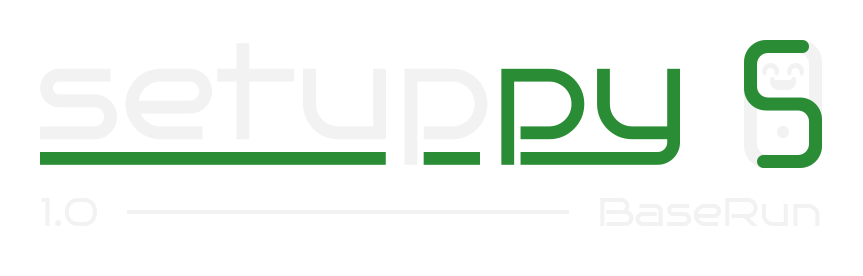

# Setuppy

**Setuppy** is a simple, Python-based automation app designed to run customizable "setups" — sequences of shell commands — with ease.
Built with the [Flet](https://flet.dev) framework, Setuppy features a minimal UI, configurable settings, and a terminal-like output display to help users automate routine tasks quickly.



> ⚠️ **Note:** Setuppy is primarily tested on **Windows**. Linux support is limited due to inconsistencies in Python dependencies.

---

## 📦 Features

- ✅ Run predefined or custom setups (multi-step command sequences)
- 🎨 Theme customization
- 🚀 Option to launch on system boot
- 🧾 Real-time terminal output
- 🔔 Optional system notifications and sound alerts
- 🔧 Error handling options
- ⏱ Adjustable interval between steps
- 📁 Supports custom setups via JSON file
- 🔍 Scalable UI (small / normal / big)

---

## 🔧 How to Use

### 1. **Download or Clone**

```bash
git clone https://github.com/joao-antonio-la/setuppy.git
cd setuppy
```
Or download and unzip the repository manually.

### 2. Run the App
Make sure you have ***Python 3.10+*** installed.

```bash
python setuppy.pyw
```
or
```bash
python setuppy.py
```

This file will:
- Create a virtual environment (.venv)
- Install required dependencies (requirements.txt)
- Launch the app

---

## ⚙️ Configuration
🗂 Setups File Format
You can modify the setups file (setups.json) with your own commands. Here's an example:

```json
{
  "Sample Setup": [
    "echo \"Welcome to Setuppy!\"",
    "echo \"We hope you enjoy.\"",
    "echo \"More versions coming in the future...\""
  ]
}
```
> ⚠️ **Careful:** Make sure that the setups file follow the format specified, or else, the app won't work properly.

```json
{
    "setup name": [
        "command 1",
        "command 2",
        "..."
    ],
    "setup name": [
        "..."
    ],
    "..."
}
```

---

## 🛠 Available Settings
- Color Theme – Change the UI color theme
- Launch on System Boot – Auto-start the app with the OS
- Show Steps Output – Display real-time output
- System Notifications – Show desktop notifications
- Sound Alerts – Play audio feedback
- UI Scale – Change UI element sizes
- Error Handling Strategy – Stop or continue on error
- Steps Interval – Time (ms) between steps
- Default Setups File – Path to the JSON setups file

> All settings can be changed via the app's UI and are saved automatically.

---

## 🗃 File Structure
```bash
setuppy/
│   .gitignore
│   README.md
│   requirements.txt
│   setuppy.py
│   setuppy.pyw
│
└───app
    ├───assets
    │   ├───icons/
    │   └───sounds/
    └───src
        ├───configs/
        ├───core/
        └───ui/
            ├───components/
            └───views/
```

---

## 📦 Dependencies
- **flet** – UI framework for building reactive apps with Python.
- **playsound** – For playing audio feedback during execution.
- **plyer** – Provides access to system features like notifications.
- **pywin32** – Required for Windows-specific features (like startup automation).

> They all will be automatically installed when running the main file.

> 🐍 **Note:** Python and library inconsistencies (especially on Linux) may require manual tweaking.

---

## 🔮 Future Versions
Setuppy is actively evolving. Upcoming versions aim to include:

- GUI for creating, editing, and deleting setups (no more editing JSON manually)
- Better visual feedbacks
- More advanced controls

...And much more

---

## 🧠 Known Limitations
- Some UI components have limited styling or interactivity due to Flet constraints.
- Linux compatibility is partial (e.g., launch on boot may not work on all distros).

📜 License
[MIT License](LICENSE)

🤖 Author
João Antônio
[GitHub](https://github.com/joao-antonio-la)